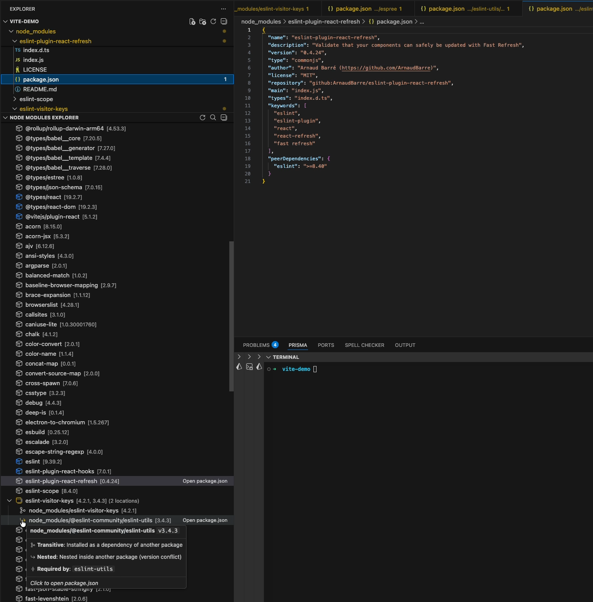

# Node Modules Inspector

A VS Code extension that provides a powerful, organized view of your `node_modules` dependencies with version information, package sizes, module type detection, and smart grouping.




## Features

- **Unified Package View**: All instances of each package grouped together, regardless of where they're installed
- **Version Conflict Detection**: Easily spot when the same package has multiple versions installed
- **Package Size Display**: See the size of each package and total size across all instances
- **Module Type Detection**: Identify whether packages use ESM, CommonJS, or both (ESM+CJS)
- **Dependency Classification**:
  - **Direct** (green): Listed in your `dependencies`
  - **Dev** (blue): Listed in your `devDependencies`
  - **Peer** (purple): Listed in your `peerDependencies`
  - **Transitive** (gray): Installed as a dependency of another package
- **Location Tracking**:
  - **Hoisted**: At the top-level `node_modules`
  - **Nested**: Inside another package (version conflict)
  - **Workspace**: In a monorepo sub-package
- **Filtering**:
  - **Duplicates Only**: Toggle to show only packages with multiple versions
  - **Exclude Patterns**: Configure glob patterns to hide packages (e.g., `@types/*`)
- **Multi-root Support**: Works with monorepos and projects with multiple `node_modules` folders
- **Quick Search**: Press `Cmd+F` (Mac) or `Ctrl+F` (Windows/Linux) to search all packages
- **Click to Navigate**: Click any package to open its `package.json` and reveal it in the Explorer
- **Open in npm Registry**: Right-click to open packages in npmjs.com or your custom internal registry

## Usage

1. Open a project with `node_modules`
2. Find the **"Node Modules Inspector"** panel in the Explorer sidebar
3. Browse packages or use the search icon to find specific packages
4. Use the filter icon to show only packages with multiple versions
5. Hover over items for detailed information
6. Click to open `package.json` files

## What You'll See

**Top-level packages show:**
- Package name
- Version (or multiple versions if conflicts exist)
- Number of instances in parentheses

**Expanded instances show:**
- Location (root, workspace path, or nested path)
- Version
- Module type (ESM, CJS, or ESM+CJS)
- Package size

## Requirements

- VS Code 1.100.0 or higher
- A project with `node_modules`

## Extension Settings

- `nodeModulesInspector.primaryRegistry`: Configure a primary npm registry for "Open in npm"
- `nodeModulesInspector.excludePatterns`: Glob patterns for packages to hide from the view

### Configuring a Custom Registry

For internal/private registries, add to your VS Code settings:

```json
{
  "nodeModulesInspector.primaryRegistry": {
    "name": "Internal Registry",
    "urlPattern": "https://npm.mycompany.com/package/{package}/"
  }
}
```

**URL Pattern placeholders:**
- `{package}`: Full package name (e.g., `@scope/name` or `lodash`)
- `{scope}`: Just the scope (e.g., `@scope`)
- `{name}`: Just the package name without scope

### Excluding Packages

Hide noisy packages from the view:

```json
{
  "nodeModulesInspector.excludePatterns": [
    "@types/*",
    "eslint-*"
  ]
}
```

## Commands

- **Refresh**: Refresh the package list
- **Search Packages**: Search all packages (`Cmd+F` / `Ctrl+F`)
- **Toggle Duplicates Only**: Show only packages with multiple versions
- **Clear Filters**: Reset all active filters
- **Open in npm Registry**: Open package in configured registry

## Known Issues

None yet! Please report issues on GitHub.

## Release Notes

### 1.3.0

- Package size display
- Module type detection (ESM/CJS/ESM+CJS)
- Filter by duplicates only
- Exclude patterns setting
- Improved inline metadata display

### 1.2.0

- Code refactoring into modular files
- Unit test coverage

### 1.0.0

Initial release:
- Package grouping by name
- Dependency type detection
- Location type detection
- Multi-root workspace support
- Search functionality

## Contributing

Contributions welcome! Please open an issue or PR on GitHub.

## License

MIT
